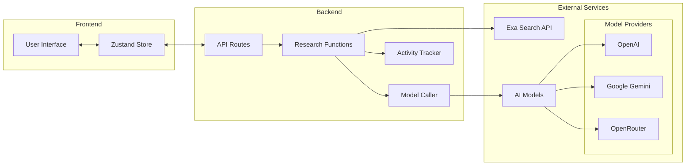
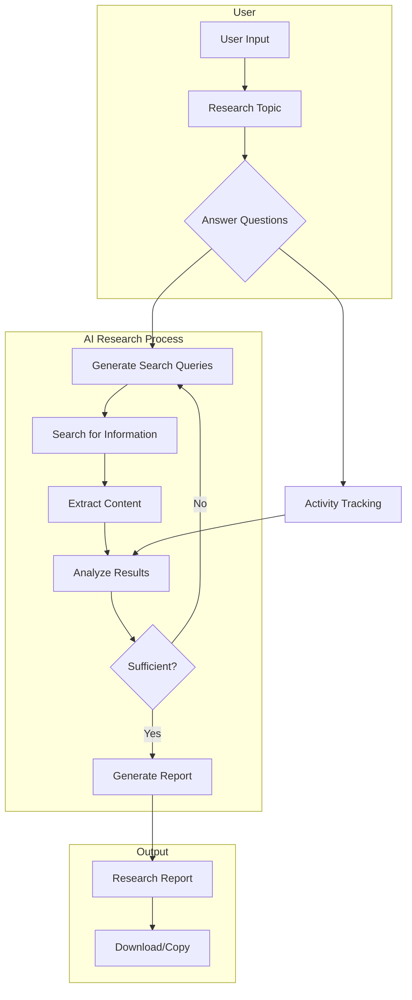

# Deep Research AI Agent

> Generate comprehensive research reports on any topic through AI-powered analysis

Deep Research is an intelligent research assistant that leveres advanced AI models to create in-depth reports on any topic. With an intuitive interface and powerful backend, it automates the research process by searching for information, analyzing content, and generating well-structured reports.

## Features

- 🔍 **Intelligent Topic Research**: Input any research topic and get a comprehensive report
- 🤔 **Interactive Clarification**: Answer questions to refine the research scope
- 🔄 **Real-time Progress Tracking**: Monitor the research process with detailed activity logs
- 📚 **Multiple AI Model Support**: Choose from Gemini, OpenAI, or OpenRouter models
- 📝 **Markdown Reports**: Download or copy reports in clean Markdown format
- 🔗 **Source Citations**: All research includes source links for reference

## System Architecture



## Research Workflow



## Tech Stack

- **Frontend**: Next.js, React, Tailwind CSS, shadcn/ui components
- **State Management**: Zustand
- **Backend**: Next.js API Routes
- **APIs**: Exa Search API, AI model providers (OpenAI, Google, OpenRouter)
- **Styling**: Tailwind CSS with custom components

## Getting Started

### Prerequisites

- Node.js 18+
- npm or yarn
- API keys for:
  - Exa Search API
  - At least one AI model provider (OpenAI, Google Gemini, or OpenRouter)

### Installation

1. Clone the repository:

```bash
git clone https://github.com/yourusername/deep-research-ai-agent.git
cd deep-research-ai-agent
```

2. Install dependencies:

```bash
npm install
# or
yarn install
```

3. Create a `.env.local` file in the root directory:

```
EXA_SEARCH_API_KEY=your_exa_api_key
OPENAI_API_KEY=your_openai_api_key
GOOGLE_API_KEY=your_google_api_key
OPENROUTER_API_KEY=your_openrouter_api_key
```

4. Start the development server:

```bash
npm run dev
# or
yarn dev
```

5. Open [http://localhost:3000](http://localhost:3000) with your browser to see the application.

## Configuration Options

The application allows configuration of several parameters:

- **Model Provider**: Choose between Gemini, OpenAI, and OpenRouter
- **Max Iterations**: Control the maximum research loops (default: 2)
- **Max Search Results**: Limit the number of search results per query (default: 1)
- **Max Content Characters**: Set the maximum content length from each source (default: 20000)

## Usage Guide

1. **Enter Research Topic**: Input your research topic on the main screen
2. **Answer Clarification Questions**: Provide answers to help focus the research
3. **Monitor Progress**: Watch as the system searches for information and analyzes content
4. **Review Report**: Once complete, review, download, or copy the generated report

## Development

### Key Workflow Components

1. **User Input**: Collects the research topic from the user
2. **Question Generation**: Creates clarification questions based on the topic
3. **Research Planning**: Generates search queries to find relevant information
4. **Content Extraction**: Processes search results into structured content
5. **Analysis**: Determines if collected information is sufficient
6. **Report Generation**: Creates a comprehensive markdown report

### Adding New Model Providers

To add support for a new AI model provider:

1. Update `src/store/deepResearch.ts` to include the new provider type
2. Add model configuration in `src/app/api/deep-research/constants.ts`
3. Implement the provider client in `src/app/api/deep-research/services.ts`
4. Update the model selection UI in `src/app/page.tsx`

## License

This project is licensed under the MIT License - see the LICENSE file for details.

## Acknowledgements

- [Next.js](https://nextjs.org/)
- [React](https://reactjs.org/)
- [Tailwind CSS](https://tailwindcss.com/)
- [shadcn/ui](https://ui.shadcn.com/)
- [Zustand](https://github.com/pmndrs/zustand)
- [Exa Search API](https://exa.ai/)
